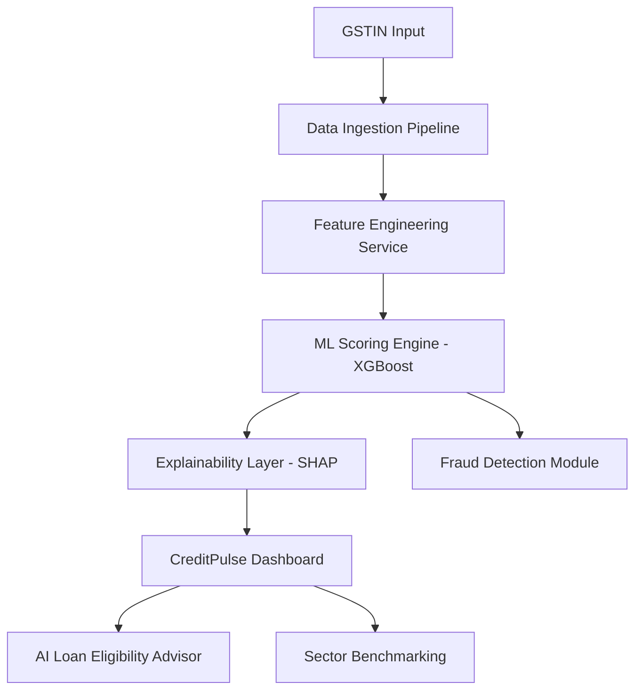

# CreditPulse: Real-Time MSME Alternative Credit Scoring System 🚀

CreditPulse is a production-grade FinTech MVP designed to solve the credit accessibility gap for Indian MSMEs. By leveraging alternative business signals—GST filings, UPI transaction velocity, and cash flow patterns—it provides a real-time, explainable credit score for businesses that lack formal credit history.

## 🏗️ Project Architecture

## 🛠️ Tech Stack
- **Frontend**: Next.js 14, Tailwind CSS, Framer Motion, Recharts.
- **Backend**: FastAPI (Python), PostgreSQL, Redis.
- **ML/AI**: Scikit-learn, XGBoost, SHAP, OpenAI/Anthropic for Agentic features.
- **Tools**: Git, Docker.

## 🌟 Key Features
- **Real-Time Scoring**: Dynamic score updates as new transaction data flows in.
- **Explainable AI (XAI)**: Provides human-readable reasons for credit scores.
- **Fraud Analysis**: Graph-based detection for circular trading and collusion.
- **Sector Benchmarking**: Compare business performance against industry averages.
- **AI Loan Advisor**: Conversational AI to guide MSMEs on creditworthiness.

## 📁 Repository Structure
- `/client`: Next.js frontend application.
- `/server`: FastAPI backend for data processing and API.
- `/ml`: Machine learning models, training scripts, and feature engineering logic.
- `/docs`: Architecture diagrams and API documentation.

---
Built with ❤️ for Indian MSMEs.
